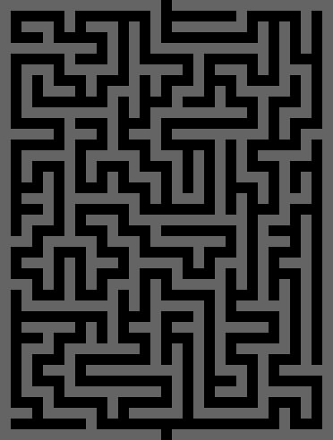
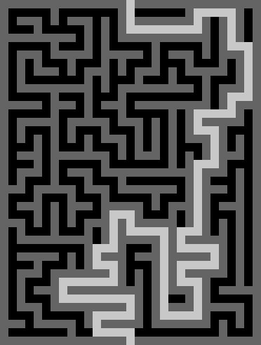

## Introduction
Maze generator makes a maze for the user with their desired specifications.
This includes maze dimensions and chosen start/end points.

## Features
* Specify maze dimensions by choosing the number of rows and columns.
* Choose where the maze starts and ends. This can be on the top, bottom,
left, or right.
* View the solution to the maze
* Choose to view the maze in ASCII graphics or as an image.
* Save the maze image as a PNG

## Example Output
A 20x15 maze starting at the top and ending at the bottom:  


And its solution:  


## Technologies
* Written in C++
* Uses OpenCV 4.6.0 for image generation
* Algorithms
    * Uses an iterative version of randomized depth-first search for maze generation,
    as found on [Wikipedia](https://en.wikipedia.org/wiki/Maze_generation_algorithm#Iterative_implementation)
    * Uses recursive depth-first search for maze solving,
    as found on [Wikipedia](https://en.wikipedia.org/wiki/Maze-solving_algorithm#Recursive_algorithm)

## Installation
Go to the main page of the repository, and copy the link. Then use
git clone to get a copy on your local computer.
```
git clone https://github.com/natewebster1/maze-generator
```
This project also requires the library OpenCV 4, so make sure to have that installed
before trying to build.

## Building
Set your current working directory to the 'maze' file within maze-generator. This 
file contains the source code. Then to build, run something like

```
g++ -std=c++11 -c -I/path/to/opencv4/headerFolder main.cpp Maze.cpp
g++ -std=c++11 -o maze.exe main.o Maze.o -L/path/to/opencv4/libraryFolder -lopencv_highgui -lopencv_imgcodecs -lopencv_core -lopencv_imgproc
```

For instance, on my local machine running macOS 12.4, I run
```
g++ -std=c++11 -c -I/usr/local/Cellar/opencv/4.6.0/include/opencv4 main.cpp Maze.cpp
g++ -std=c++11 -o maze.exe main.o Maze.o -L/usr/local/Cellar/opencv/4.6.0/lib -lopencv_highgui -lopencv_imgcodecs -lopencv_core -lopencv_imgproc
```

Now, you have a 'maze.exe' executable.


## Usage
To start the program, run
```
./maze.exe
```

The program will run indefinitely, but can be stopped in gcc with Ctrl-c .

A couple tricky parts about usage:
* You must first click on the pop up window of the maze image before entering a command to proceed
* When picking a directory to save the image to, it should be in the form '/some/directory/'
    * The specific file name is left off because a name for the file is generated from its specs
    * To save it to my desktop, I enter '/Users/natewebster/Desktop/'
